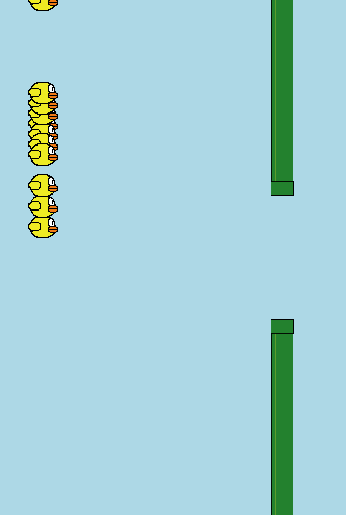

# FlappyDirb
Using reinforcement learning FlappyDirb is a game that teaches itself to play



- [FlappyDirb](#flappydirb)
  - [Description](#description)
  - [Getting Started](#getting-started)
    - [Dependencies](#dependencies)
    - [Instalation](#instalation)
    - [Executing program](#executing-program)
  - [Help](#help)
    - [Possible optimization](#possible-optimization)
  - [Authors](#authors)
  - [Art](#art)


## Description
inpired in the popular game FlappyBird and using NEAT (NeuroEvolution of Augmenting Topologies)

## Getting Started
### Dependencies

- [Python](https://www.python.org/downloads/)
- [Pygame](https://www.pygame.org/wiki/GettingStarted)
- [NEAT-Python](https://neat-python.readthedocs.io/en/latest/)

### Instalation
Using [pip package manager](https://packaging.python.org/en/latest/tutorials/installing-packages/)
```bash
pip -r requirements.txt
```

### Executing program
```bash
python main.py
```
or 
```bash
python3 main.py
```
## Help
As far as I can tell the first few moments of running the program are very "laggy" due to the amount of calculations that the program requires over the amount of samples "players" present, it does get better as the start to die off.

### Possible optimization
I imagine that if one would remove the process of drawing the window every frame the project speed would experience considerable improvement

## Authors
[Rodolfo Frainer](https://github.com/rodolfofrainer)

## Art
I created all assets used in this project with the sole intention of being a one-use-scenario